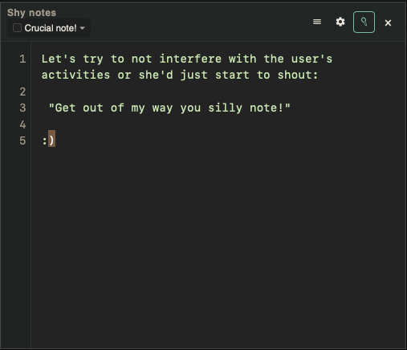

# shy-notes

A floating desktop notepad that gently moves aside when your cursor approaches — unless you aim for its center and capture it to write.



**Repository:** [github.com/imeavesdroppingme/shy-notes](https://github.com/imeavesdroppingme/shy-notes)

If you like this app, leave a short message at [imeavesdropping.com](https://imeavesdropping.com).

## Features (MVP)

- Always-on-top undecorated window with plain-text editor
- Soft evasive repulsion based on cursor trajectory (hold **Ctrl** to suppress)
- Drop text or plain-text files into the note (hold **Ctrl** or pin to approach while dragging)
- Clickless capture via a central capture surface + optional glow
- Pin / unpin, settings window, tray menu
- Multiple local notes with selector, optional title, background/foreground colors, font size
- Local persistence of text, pose, prefs, and metadata (no accounts, no network, no cloud)
- Global shortcut: `Cmd+Shift+Space` (macOS) / `Ctrl+Shift+Space` (Windows/Linux)
- Optional open-at-startup (tray); window close hides to tray
- macOS Accessibility guidance dialog when permission is missing

## Stack

- Tauri 2 + Rust + TypeScript
- Pure geometry/state machine in `crates/interaction-core`

## Develop

```bash
pnpm install
pnpm tauri dev
```

Debug logging (pin, tray, visibility):

```bash
SHY_NOTES_DEBUG=1 pnpm tauri dev
```

Local checks:

```bash
./scripts/ci-local.sh
```

This runs unit tests, e2e cursor-session replays (`crates/interaction-core/tests/e2e_replay.rs`), frontend build, and a short binary smoke launch (`tests/e2e/smoke.sh`). Full GUI feel-testing (Accessibility + real mouse) remains manual.

## Linux notes

**Use an X11 session for evasion.** Cursor flee and capture glow need global mouse position and free window placement; Wayland compositors do not expose those to apps.

| Session | Evasion | Rest of the app |
| --- | --- | --- |
| **X11** (supported) | Works | Works |
| **Wayland** (best-effort) | Broken / stuck glow | Editor, tray, settings, notes OK |

On Debian / KDE Plasma: at the login screen (SDDM), open the session menu and choose **Plasma (X11)** instead of **Plasma (Wayland)**. On Wayland the window title and Settings show a short warning.

## Packaging

Unsigned local builds:

```bash
pnpm tauri build
```

Cross-platform CI builds (macOS / Windows / Linux `.deb`) via GitHub Actions — see [docs/packaging.md](docs/packaging.md). Trigger **Actions → Release**, or push a `v*` tag; assets land on a **draft** GitHub Release.

Code signing and Apple notarization are deferred until release credentials are available.

## License

GPL-3.0-only — see [LICENSE](LICENSE).
